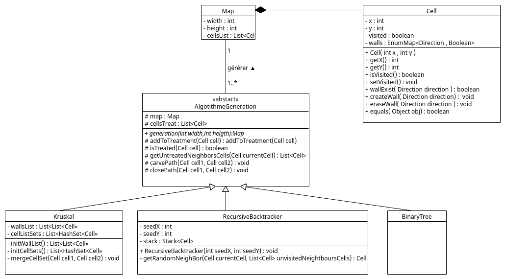
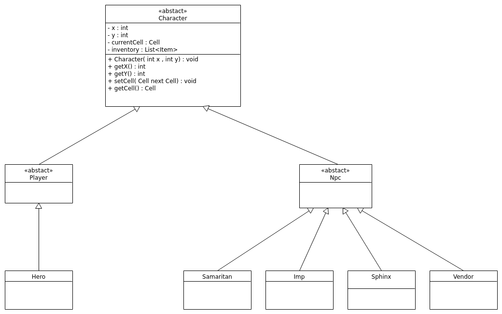
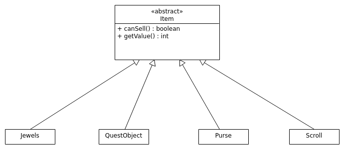
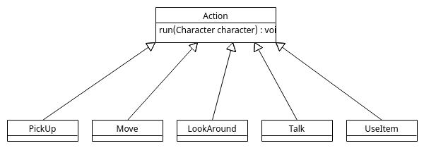
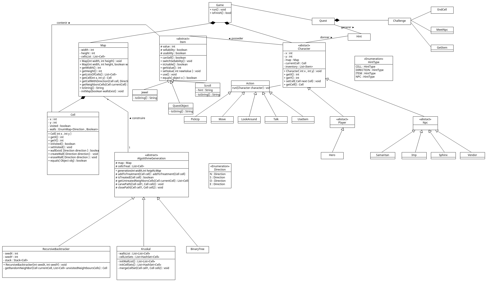

# l2s4-projet-2022

# Equipe

- Jérémy Woirhaye
- Franck Beyaert
- Timothé Vanoverberghe

# Sujet

[Le sujet 2022](https://www.fil.univ-lille1.fr/portail/index.php?dipl=L&sem=S4&ue=Projet&label=Documents)

# Document de conception

[Nos documents de conception](conception/README.md)

# Livrables

## Livrable 1

[Nos documents de conception de labyrinthe](conception/mazeConception.md)

UML Livrable 1:

### Atteinte des objectifs

Pour le premier livrable, tous les objectifs principale on été atteint:
- Création de labyrinthe
- Implémentation de deux algorithmes de génération au minimum 
- Ecriture des tests pour tous le système de génération de labyrinthe

> Des modification seront à apporter pour la classe Maze pour l'implémentation des perssonages et action

### Difficultés restant à résoudre

Aucune difficultés restante à résoudre pour le premier livrable

## Livrable 2

Pour le livrable 2 nous avons du modéliser les personnages et les objets.

#### Les personnages

On peut facilement distinguer deux classe de personnage, les personnage qui vont agir en fonction du joueur, et les personnage non joueur donc ceux qui n'ont pas besoin d'interaction avec le l'utilisateur (donc le joueur).

A ce stade nous avons donc trois classe :
- Character (Personnage)
- Player (Joueur donc les personnage controlé par l'utilisateur)
- Npc (Personnage Non Joueur)

Ici nos trois classes sont des classes abtraite, la classe Character va définit certaine méthode et attribut qui sont générale à un personnage, par exemple stocké et récupérer sa position. Les classe Player et Npc qui hérite de la classe Character d'autre méthode et attribut relative à leur personnage.

Par exemple les Player doivent attendre une saisie utilisateur pour effectuer un action en fonction de sa demande, alors que les Npc peuvent effectuer une action automatique car c'est notre code qui vas la calculer.

Par exemple un Player est controller par l'utilisateur, si l'utilisateur veut faire bouger le personnage Player à droite on doit récupérer la saisie utilisateur pour lui dire de bouger à droite, alors que pour un Npc son comportement est indépendant des choix du joueur, donc on peut définir un comportement propre a ce type de personnage.

Donc Hero héritera de la classe abstraite Joueur et le Sphinx par exemple de la classe abstraite Npc.

Cette modélisation nous permet d'ajouter les personnage jouable et non jouable de manière simple sans avoir à modifier de code existant.

Bien sur pour établir cette modélistation nous avons du prendre en compte de futur action etc

[Nos documents de conception des personnage](conception/characterConception.md)

#### Les objets

Pour les objets nous allons juste définir une classe Item qui généralisera le comportement des objets.

Chaque objet héritera donc de cette classe.

[Nos documents de conception des objets](conception/ItemsConception.md)

Pour la conception des objets, nous avons écrit une classe Item et les classes objets qui en héritent, tout les objets ont un comportement similaires donc nous allons transformer la classe Item en classe abstraite et les classes concrètes seront chaque type d'objet voulu.
Ils restera à gerer les interactions entre item et character pour gérer les ventes et les utilisations d'objet et ce que verra le joueur lors de ces utilisations.

### Atteinte des objectifs

Tous les objectifs pour les objets ont été atteints il restera des modifications à apporter pour faire le lien avec la gestion des actions.
-Création de la classe abstraite Item qui donne le comportement que suit chaque objet et la méthode abstraite use
-Création des sous classe ( Parchemin, Objet de quête et Joyau).

### Difficultés restant à résoudre

Reste à faire la gestion des pièces d'or du joueur

## Livrable 3

### Atteinte des objectifs

Ecriture de l'UML avant le dévelopement

Création des actions de manière générique grâce a une classe abstraite pour pouvoir facilement ajouter des actions au jeu 

### Difficultés restant à résoudre

Aucune difficultés restante à résoudre pour le troisieme livrable

## Livrable 4

### Atteinte des objectifs

UML Final :  

Nous avons fini tous ce qui étais prévu.

C'est à dire les implémentations qui été a finir :

- Les indices  
- Le sys de achat/vente du Marchands  
- Ecriture des tests  

### Difficultés restant à résoudre

# Journal de bord

## Semaine 1

Pendant cette semaine nous avons réfléchi à l'implémentation du labyrinthe pour cela nous avons regardé les labyrinthes dits "parfaits" et rechercher les algorithmes classiques de génération, nous en avons dénombré 12 au total même s'il doit surement en avoir plus toute notre recherche est décrite dans le document mazeConception.md ( [Etude et recherche sur les algorithmes](conception/mazeConception.md) ) en dicutant ensemble nous avons orienté nos choix possible vers certain algorithme :

- Arbre Binaire pour une première decouverte de ce type d'algorithme de plus très simple

- Recursive Backtracker un premier vrai choix qui est justifié dans notre document de Conception

- Division récursive qui peut améliorer la difficulté du labyrinthe lors du jeu (Sugestion de Franck)

- Kruskal ou Prim's qui peuvent être de très bon algorithme au niveau de la complexité (même si durant le projet il n'est pas demandé de regarder cela)

Création de la structure global du projet et réflexion sur le modèle d'implémentation en java pour respecter les contraintes + discutions avec l'enseignant pour être sûr de bien comprendre les contraintes

Implémentation de la structure et du labyrinthe avec le premier algorithme (Arbre Binaire)

#### Difficulté 

1 : Comment tester si les algorithmes sont bien parfait alors qu'il hérite d'une interface en d'autre terme comment faire pour ne pas réécrire des tests pour chaque algorithmes 

## Semaine 2

Jérémy: Pour m'amuser j'ai essayé d'implémenter l'algorithme de Kruskal le plus vite possible car il avait l'air un peu compliqué 
je me suis donc fixé 1 heure pour obtenir un algorithme fonctionnel qui respecte les contraintes sans ecrire de test ou autre uniquement le code du début j'ai uniquement fait des recherches sur l'algo son fonctionnement et réfléchi à comment l'implémenter en ecrivant le code sans faire de test fonctionnel, au bout de 35 minute j'ai effectué un premier test fonctionnel au vu des résultats mon algo avait un problème j'ai donc commencer a debuger et je me suis rendu compte que c'était un problème lors de la fusion des Set de cellule je n'ajouter qu'une cellule celle en parametre a mon premier set et je supprimer l'autre j'ai donc corrigé cela en ajoutant toute les cellules du deuxieme set au premier résultat au bout de 54 minute mon algo fonctionner au vu des test fonctionnel sans problème et generer bien des labyrinthe parfait. Bien sur l'implémentation de base à aider et l'algo est améliorable comme en enlevant la classe Wall et la remplacer par des liste de taille 2 car il n'y a pas grand chose dedans et bien d'autre chose mais vu le temps fixé je trouve ça déja bien :)

Réfléxion sur l'organisation pour les livrables en equipe (Tag ?)

Franck: Dev de l'algo Recursive Division

Timothe: Dev de l'algo Automaton cellulaire   

Réfléxion pour l'organisation du test de vérification de labyrinthe parfait car classe implémenter très longue

Etude sur les branch git pour utilisation dans le projet pour avoir une branche main propre 

#### Difficulté 

1 : La methode Maze.fillMaze généré des cases inutile mais ne provoqué pas forcement d'exception donc compliqué à corrigé même avec l'utilisation du débugeur qui ne permeter de voir uniquement les méthodes parcouru de plus le problème provoqué une exception uniquement avec l'algorithme de kruskal. La correction du problème à aussi résolu le fais que les algorithmes sauf BinaryTree ne pouvait pas générer de labyrinthe rectangulaire.

2 : Le test pour la vérification de labyrinthe parfait fonctionne mais ne compte pas le nombre de cellules exact lorsqu'il n'est pas parfait actuellement le problème n'est pas résolu (04/02/22-18:28) 

## Semaine 3

Jérémy: Test labyrinthe parfait terminer, suppression class Wall, car on peut facilement la remplacer par une liste taille 2 car wall n'est utilsé que pour récuperer la cell1 et cell2. Mise en place du premier sys d'intération utilisateur. Ecriture de tous les tests coverage 95% ( > 90% OK) Mise a jour du journal de bord + javaDoc. Sys héritage test algo terminé. Modification a faire au niveau de la gestion des etats des cellules lors de la génération changer d'etat pour ne pas utiliser visiter mais un autre cas l'état visite doit etre true qd le joueur est passé sur la case pas l'algo. Voir pour optimisation ou simplification de certain test (Maze Test) et relecture du code pour géstion des cas particulier.

## Semaine 4

## Semaine 5

Semaine d'examen nous n'avons donc pas avancer pour nous consacrer au examen.

## Semaine 6

Répléxion sur l'implémentation des personnages en groupe et sur le système de discution entre les personnages. Nous avons decider de stocker les phrase et autre interation texte dans un fichier JSON pour ne pas surcharger les classes

Jérémy : Recherche pour utilisation de JSON en java (org.json) puis test d'utilisation de la lib

## Semaine 7

Refléxion sur la structure du JSON en groupe

Franck : Ecriture des dialogues pour les personnages

## Semaine 8

Jérémy : Mise en place du systeme de déplacement des personnages et ecriture des test complementaire. Création de la classe game qui s'occupe de la gestion du jeu 
Mise en place de l'interation utilisateur + Implementation d'un Displayer et Input qui permette de rendre l'entrer utilisateur et l'affichage generique en cas d'extension.

Nons avons décider de faire un réorganiser le projet en etablisant un UML global pour pouvoir avoir une vu d'ensemble pour pouvoir définir ou ajouter les nouvelle implémentation et affiner pendant l'implémentation au niveau du code.

Nous avons donc décider :

- De supprimer toute la conception precedante des personnages pour la refaire au propre.
- De réorganiser la génération du labyrinthe.
- Bien réorganiser le projet et les classes

Franck : Pour le 27/03/22 Commencer l'implémentation des Personnages. 
Création de la class abstraite Character. Création des class concrete des npc.  
Timothe : Pour le 27/03/22 Commencer l'implémentation des Objets  
Jérémy : Pour le 27/03/22 Refonte de la structure du projet et du Plateau de jeu + Nettoyage du code

#### Difficulté 

Comment gerer les differentes interation entre personnage quand on attends des saisie utilistateur

## Semaine 9

Jérémy : Quest et Challenge 

## Semaine 10

Timothe: Doit faire Action ramasser et utiliser (pour les objet)

Franck: Doit faire Action discuter et se déplacer 

Jérémy : Doit faire Action regarder

## Semaine 11
Jérémy : Action lookaround et doNothing + Implémentation de game + Ecriture des tests + Challenge FinalCase

Jérémy : Création d'un google drive pour upload des vidéo pour aider le groupe avec des commentaire vidéo, des conseils et des exemples

[Lien du drive](https://drive.google.com/drive/folders/1TQ4cVKrRmaQw1deNeURHc44K0_ArsCkl?usp=sharing)

Timothé : Avec l'aide de Jérémy pour le code java, Actions PickUp et UseItem faite en modifiant l'implementation de la cellule pour l'action PickUp

Franck : Création de l'Action Discuter, Modification de celle-ci ( débugg etc ) avec l'aide de Jeremy. L'action se déplacer a était réalisé par Jeremy suite à un problème de pc que j'ai lors des semaines pédagogiques.

## Semaine 12

Jérémy : Création d'un game builder, Ecriture des tests utitaire, Modification de l'affichage, Maj de l'action regarder, Maj du makefile, Maj Main pour rendu, Ecriture Javadoc et Maj géstion saisie utilisateur.

Jérémy : Ajout des affichage manquant pour l'utilisateur. 

Timothé : Gestion des pièces d'or du joueur pour l'action de vente et les objectifs de quête

