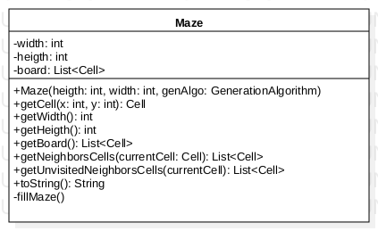

# Conception du plateau de jeu

[Retour](README.md)

## Enoncé

Comme la quête du héros est associée à une case particulière du labyrinbthe, il faut nécessairement que le labyrinthe
construit permette l’accès à ladite case. On mettra donc en oeuvre des algorithmes permettant de construire de
labyrinthes parfaits (2 algorithmes différents seront implémentés).

-> Dans cette énoncé nous pouvons déja apercevoir une premiere contrainte, le labyrinthe généré doit être dit "parfait".

## Contrainte du plateau

Génération:

- le labyrinthe doit possèdé au minimum 2 algo de génération
- Respect du principe ouvert-fermé

## Conception Préliminaire

### Algorithmes de génération de labyrinthe parfait 

D'après nos recherche on dénombre environ 12 algorithmes classiques pour la génération de labyrinthes "parfaits".

- [x] Kruskal
- [ ] Prim's
- [x] Recursive Backtracker (ou Exploration exhaustive)
- [ ] Aldous-Broder
- [ ] Arbre en croissance
- [ ] Hunt-and-Kill
- [ ] Wilson's
- [ ] Eller
- [ ] Automaton cellulaire (facile)
- [X] Division récursive (très facile)
- [ ] Sidewinder (prévisible)
- [x] Arbre binaire

Comme pour notre projet il n'est pas necessaire de regarder si un algorithme et meilleur qu'un autre nous allons juste comparer  
quelque un de ces algorithmes pour avoir un idée générale

### Arbre binaire

Le principe de cette algorithme est très simple : pour chaque cellule de la grille, on efface au hasard un passage vers le sud ou l'est. 

##### Exemple

  

##### Pseudo-code

```
	On parcourt une à une toutes les cellules de la grille
	Pour chaque cellule on detruit aléatoirement le mur Est ou Sud:  
		- si on est sur le bord droit on detruit le mur sud  
		- si on est sur le bord bas on detruit le mur est  
		- si on est sur le coin bas droit on ne detruit aucun mur  
```
##### Avantage

Très simple à réaliser, génére un labyrinthe parfait sans conserver le moindre état. Il peut construire le labyrinthe entier en ne regardant qu'une seule cellule à la fois.

##### Inconvénient

Trop simple à résoudre il suffit de faire des déplacement droite bas pour un algo sud-est ce algorithme minimum qui il n'y a pas de cul-de-sac (et il n'y en aura jamais)

### Recursive Backtracker (ou Exploration exhaustive)

##### exemple

  

##### Pseudo-code
```
	tant que la pile n'est pas vide:
  		soit c la premiere cellule de la pile
  		on recherche les voisines non visité de c

  		si il y en a
     			soit cn une de ces voisines, choisi au hasard 
      			on détruit le mur entre c et la cellule cn
      			on indique dans que c est visité
      			on ajoute cn a la pile
  		sinon
      			on retire le premier élément de pile
```

##### Avantage

La formulation récursive donne de très bons résultats pour des labyrinthes de taille modeste.

##### Inconvénient

Dès lors que l'on veut générer de grands labyrinthes (1000 x 1000, par exemple), le programme risque de se terminer brutalement si la taille de la pile est insuffisante.


### Kruskal

##### exemple

  

##### Pseudo-code
```
	tant que la pile n'est pas vide:
  		soit c la premiere cellule de la pile
  		on recherche les voisines non visité de c

  		si il y en a
     			soit cn une de ces voisines, choisi au hasard 
      			on détruit le mur entre c et la cellule cn
      			on indique dans que c est visité
      			on ajoute cn a la pile
  		sinon
      			on retire le premier élément de pile
```

##### Avantage

La formulation récursive donne de très bons résultats pour des labyrinthes de taille modeste.

##### Inconvénient

Dès lors que l'on veut générer de grands labyrinthes (1000 x 1000, par exemple), le programme risque de se terminer brutalement si la taille de la pile est insuffisante.

### Implémentation et UML

##### Labyrinthe

  

##### Cellule

##### Direction

##### Algorithme de génération

### Division Récursive 

Le principe de la division récursive peut être expliqué en 4 étapes :
 - Etape 1 : Commencer avec un terrain vierge / blanc
 - Etape 2 : Couper en deux le terrain via un mur horizontal ou vertical. Ajouter un point de passage à travers le mur.
 - Etape 3 : Répéter l'etape 2 de chaque côté du mur.
 - Etape 4 : Continuer récursivement, jusqu'à obtenir le labyrinthe désiré.
 
##### exemple

##### Pseudo-code

##### Avantage


##### Inconvénient


### Test à implémenté

Labyrinthe:
- Le labyrinthe est parfait
- Les contours son fermé