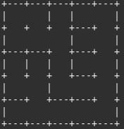
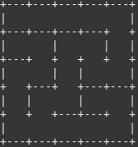
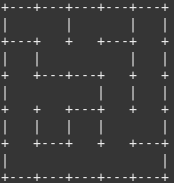
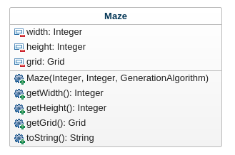
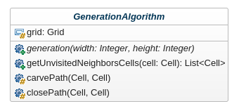
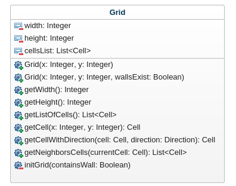
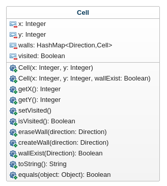

# Conception du plateau de jeu

[Retour](README.md)

## Enoncé

Comme la quête du héros est associée à une case particulière du labyrinbthe, il faut nécessairement que le labyrinthe
construit permette l’accès à ladite case. On mettra donc en oeuvre des algorithmes permettant de construire de
labyrinthes parfaits (2 algorithmes différents seront implémentés).

-> Dans cette énoncé nous pouvons déja apercevoir une premiere contrainte, le labyrinthe généré doit être dit "parfait".

## Contrainte du plateau

Génération:

- le labyrinthe doit possèdé au minimum 2 algo de génération
- Respect du principe ouvert-fermé

## Conception Préliminaire

### Algorithmes de génération de labyrinthe parfait 

D'après nos recherche on dénombre environ 12 algorithmes classiques pour la génération de labyrinthes "parfaits".

- [x] Kruskal
- [ ] Prim's
- [x] Recursive Backtracker (ou Exploration exhaustive)
- [ ] Aldous-Broder
- [ ] Arbre en croissance
- [ ] Hunt-and-Kill
- [ ] Wilson's
- [ ] Eller
- [ ] Automaton cellulaire (facile)
- [x] Division récursive (très facile)
- [ ] Sidewinder (prévisible)
- [x] Arbre binaire

Comme pour notre projet il n'est pas necessaire de regarder si un algorithme et meilleur qu'un autre nous allons juste comparer  
quelque un de ces algorithmes pour avoir un idée générale

### Arbre binaire

Le principe de cette algorithme est très simple : pour chaque cellule de la grille, on efface au hasard un passage vers le sud ou l'est. 

##### Exemple

  

##### Pseudo-code

```
	On parcourt une à une toutes les cellules de la grille
	Pour chaque cellule on detruit aléatoirement le mur Est ou Sud:  
		- si on est sur le bord droit on detruit le mur sud  
		- si on est sur le bord bas on detruit le mur est  
		- si on est sur le coin bas droit on ne detruit aucun mur  
```
##### Avantage

Très simple à réaliser, génére un labyrinthe parfait sans conserver le moindre état. Il peut construire le labyrinthe entier en ne regardant qu'une seule cellule à la fois.

##### Inconvénient

Trop simple à résoudre il suffit de faire des déplacement droite bas pour un algo sud-est ce algorithme minimum qui il n'y a pas de cul-de-sac (et il n'y en aura jamais)

### Recursive Backtracker (ou Exploration exhaustive)

##### exemple

  

##### Pseudo-code
```
	tant que la pile n'est pas vide:
  		soit c la premiere cellule de la pile
  		on recherche les voisines non visité de c

  		si il y en a
     			soit cn une de ces voisines, choisi au hasard 
      			on détruit le mur entre c et la cellule cn
      			on indique dans que c est visité
      			on ajoute cn a la pile
  		sinon
      			on retire le premier élément de pile
```

##### Avantage

La formulation récursive donne de très bons résultats pour des labyrinthes de taille modeste.

##### Inconvénient

Dès lors que l'on veut générer de grands labyrinthes (1000 x 1000, par exemple), le programme risque de se terminer brutalement si la taille de la pile est insuffisante.


### Kruskal

##### exemple

  

##### Pseudo-code
```
	
```

##### Avantage


##### Inconvénient


### Division Récursive 

Le principe de la division récursive peut être expliqué en 4 étapes :
 - Etape 1 : Commencer avec un terrain vierge / blanc
 - Etape 2 : Couper en deux le terrain via un mur horizontal ou vertical. Ajouter un point de passage à travers le mur.
 - Etape 3 : Répéter l'etape 2 de chaque côté du mur.
 - Etape 4 : Continuer récursivement, jusqu'à obtenir le labyrinthe désiré.
 
##### exemple

##### Pseudo-code

##### Avantage


##### Inconvénient


### Implémentation et UML

Pour l'implémentation on choisi de représenter plusieurs entiter tous d'abord le labyrinthe (Maze) qui sera l'élément principale de notre conception, cette entité fais appelle dans son constructeur a un algorithme de génération de labyrinthe parfait.

Pour représenter notre labyrinthe on crée une entité grille (Grid) qui nous permet d'ecrire des méthodes afin de faciliter la representation du plateau, il est possible d'utiliser un tableau 2D afin d'obtenir le même résultat mais notre entité a de nombreux avantage ( avantage et explication plus précise en desous de l'UML Grid) cette grille est composer de cellule (Cell) qui possède eux aussi des attributs et méthodes propre.

Maintenant qu'on sait que notre plateau est representer par une grille il est très simple de determiner le fonctionnement. Maze fais appelle dans son constructeur à la méthode generate qui renvoie un Objet Grid qui possède la carractéristique demander donc un labyrinthe parfais ce même algorithme lui crée un objet Grid qu'il va modifier en labyrinthe parfais grace a son algorithme

##### Labyrinthe

 

Attention : si on décide de crée un nouvelle algo il faut bien que cette classe passe les tests, pour crée les test il suffit de crée une classe qui extends de GenerationAlgorithmTest et de mettre la grille généré dans l'attribut grid

##### Algorithme de génération

  

Cette classe est une classe abstraite, la classe Maze fera appel a la méthode genrate afin d'obtenir une grille,
donc pour crée un nouvel algorithme il suffit de crée un classe qui hérite de celle ci et de renvoyé une grille qui est modifié par cette même classe, certaine méthode sont disponible sur la classe mère pour simplifier certain traitement relatif à la génération par exemple créé un passage entre deux cellule ou fermé un passage ces méthodes sont générique donc toujours utilisable

##### Grille

  

Grid est utiliser pour représenter le plateau de jeu il s'occupe des calcules et de la récupération dans le plan

Le stockage des cellules est fait avec une structure de donnée List<Cell> qui possède l'avantage d'avoir un méthode contains() qui va utiliser la méthode equals d'un objet pour vois si il est ou non dans la liste. Puisque la méthode equals de Cell compare les positions en x et y uniquement on peut facilement vérifier si la position d'une cellule est dans la grille ou non, par exemple pour récuperer les cellules voisine on test si la cellule a la position x+1,x-1,y+1,y-1 existe et on l'ajoute a la liste. Comme toutes les cellules sont initialisé a la création de Grid si on compare si la cellule Cell(-1,0) existe dans la liste comme on a notre méthode equals il nous renvoie False on sait donc que la cellule n'est pas dans la grille, si on avait utilisé un tableau 2D on aurait eu une OutOfBoundException ou on aurait du géré plusieurs cas et calculer si la cellule est initialiser dans la grille ou non.


##### Cellule

  

L'objet Cell n'est pas très complexe il stocke des données par rapport à sa position dans la grille, un état pour savoir si la cellule est visité et des méthodes afin de modifié ses murs  


